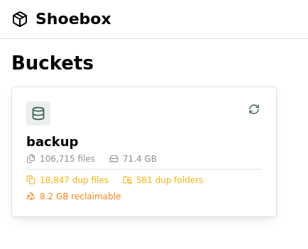

# Shoebox

[](https://github.com/deepjoy/shoebox/actions/workflows/ci.yml)
[](https://crates.io/crates/shoebox)
[](https://ghcr.io/deepjoy/shoebox)
[](LICENSE)

A local S3-compatible server for your files. Find duplicates, verify integrity, zero config.



## Install

```bash
# Docker (recommended)
docker pull ghcr.io/deepjoy/shoebox:latest

# Or via Cargo
cargo install shoebox
```

## Quick Start

```bash
# Point Shoebox at one or more directories
shoebox ~/Photos ~/Documents

# Output:
# Serving 2 buckets on http://localhost:9000
#   photos    → /home/user/Photos
#   documents → /home/user/Documents
```

Files already on disk appear in S3 immediately — no uploading required. Use the AWS CLI, rclone, or any S3 SDK:

```bash
aws --endpoint-url http://localhost:9000 s3 ls s3://photos/
```

[](https://asciinema.org/a/0zpWhRhyMKbrqt0S)

## Features

- **S3-compatible API** — works with AWS CLI, rclone, and any S3 SDK out of the box
- **Zero-config startup** — just point at directories, no cloud account or configuration needed
- **Duplicate detection** — find and merge duplicate files and directories via content hashing
- **Integrity verification** — scheduled checks to detect bit rot and data corruption
- **Filesystem sync** — background scanning with move detection, real-time file watching
- **Authentication** — AWS Signature V4, per-bucket credentials, pre-signed URLs
- **Multipart uploads** — full support for large file uploads
- **CORS** — browser-based clients work out of the box
- **Webhook notifications** — get notified on object events (put, delete, copy)
- **Single binary, ~10MB** — no runtime dependencies

## Duplicate Detection

Shoebox hashes every file (SHA-256) in the background. Finding duplicates is a query:

```bash
$ shoebox duplicates ~/Photos --format table

Duplicate groups (2 groups, 5 files, 3 duplicates):

  Hash (SHA-256)       Size   Files
  ─────────────────────────────────────────────
  a]3f…c8d1            32 B   3 copies
    originals/sunset.txt
    backup/sunset.txt        ← duplicate
    edited/sunset-copy.txt   ← duplicate

  7b2e…f104            26 B   2 copies
    originals/mountain.txt
    backup/mountain.txt      ← duplicate
```

Pick a winner, delete the rest:

```bash
$ shoebox duplicates ~/Photos --merge
```

## Webapp

A companion browser UI is available at **https://deepjoy.github.io/shoebox-webapp/**.

Browse buckets, view objects, and see duplicate groups visually — no CLI needed. The webapp talks directly to your local Shoebox server via the S3 API.

**CORS setup** (required for browser access):

```bash
aws s3api put-bucket-cors --endpoint-url http://localhost:9000 --bucket photos --cors-configuration '{
  "CORSRules": [{
    "AllowedOrigins": ["https://deepjoy.github.io"],
    "AllowedMethods": ["GET", "PUT", "DELETE", "HEAD"],
    "AllowedHeaders": ["*"],
    "ExposeHeaders": ["ETag", "x-amz-request-id"],
    "MaxAgeSeconds": 3600
  }]
}'
```

## Who It's For

- **Developers** — test S3 integrations without cloud dependencies, work offline
- **Home users** — expose NAS storage to S3-compatible backup tools, find duplicates with a single query
- **Archivists** — verify file integrity with content hashes, detect bit rot
- **Privacy-conscious users** — keep files local, no account required, no telemetry

## Comparison

| Concern | Cloud S3 | MinIO | SeaweedFS | Garage | Shoebox |
|---------|----------|-------|-----------|--------|---------|
| Primary strength | Scalability, AWS ecosystem | High performance, enterprise | Small files, high throughput | Simplicity, geo-replication | Existing files, zero config |
| Best for | Production workloads | AI/ML, large data (TB/PB) | Data lakes, file storage | Edge/distributed, low ops | Local dev, NAS, home lab |
| Architecture | Managed service | Specialized nodes | Master/volume servers | Homogeneous nodes | Single process |
| Setup | Account + IAM | Docker + config | Docker + config | Docker + config | Single command |
| Data location | Cloud | MinIO data dir | SeaweedFS volumes | Garage data dir | Your existing files |
| File visibility | S3 only | S3 only | S3 only | S3 only | Filesystem + S3 |
| Offline use | No | Yes | Yes | Yes | Yes |
| Binary size | N/A | ~200MB | ~40MB | ~25MB | ~10MB |
| Duplicate detection | No | No | No | No | Built-in |
| Integrity checks | No | Yes (bitrot healing) | No | Yes (scrub) | Built-in (scheduled) |
| Max recommended scale | Unlimited | Petabytes | Petabytes | Petabytes | ~10TB |

See [docs/why-shoebox.md](docs/why-shoebox.md) for the full story.

## When Not to Use Shoebox

See [docs/when-not-to-use-shoebox.md](docs/when-not-to-use-shoebox.md) for an honest assessment of limitations, including:

- Strong consistency requirements
- Distributed / multi-node storage
- \>10TB of data
- Enterprise S3 features (object lock, lifecycle policies, versioning)
- High-throughput ingestion (thousands of files/second)

## Documentation

- [Quickstart](docs/quickstart.md) — Running in 5 minutes
- [Installation](docs/installation.md) — Docker, cargo install, from source
- [User Guides](docs/README.md) — Configuration, credentials, S3 compatibility, and more

## Contributing

See [CONTRIBUTING.md](CONTRIBUTING.md) for development setup and guidelines.

## Security

See [SECURITY.md](SECURITY.md) for the security model and how to report vulnerabilities.

## License

MIT

## Background

I had 2TB of photos across 3 drives — backups of backups, originals I was afraid to delete. I set out to find duplicate photos and accidentally designed a local S3 server. If an object store knows the content hash of every file, duplicates are just a query. This is a personal project built in public — expect breaking changes before 1.0. If you have thoughts on the approach, [open an issue](https://github.com/deepjoy/shoebox/issues) or start a discussion.
