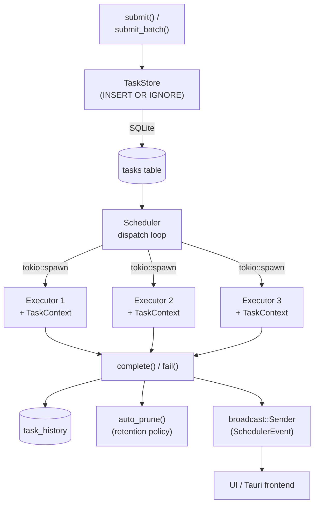
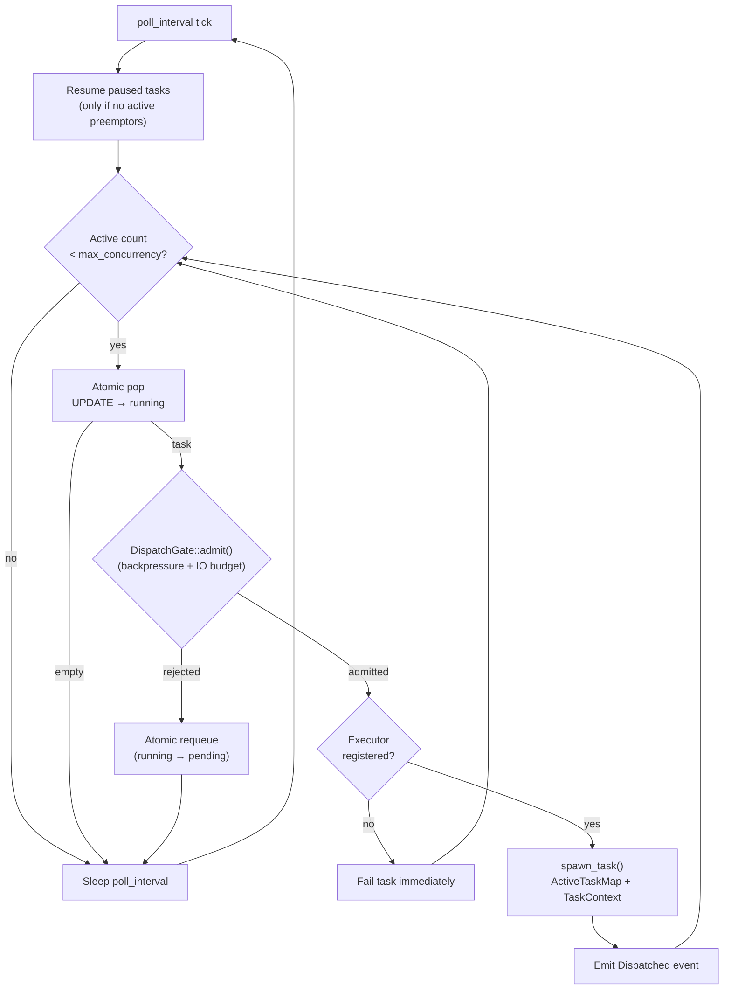
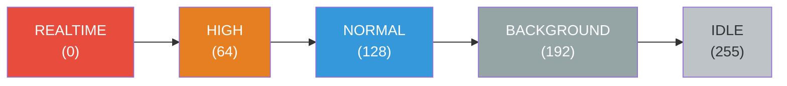
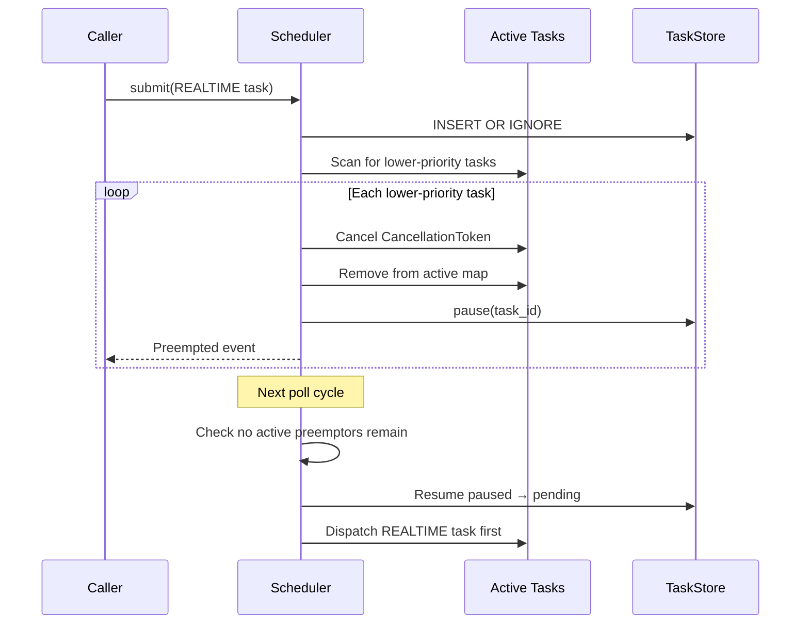
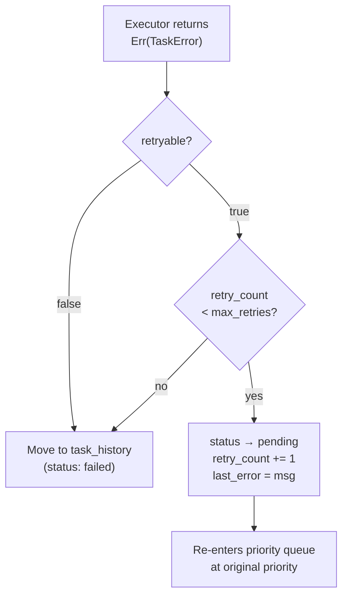

# Taskmill Architecture

This document describes the internal architecture of taskmill, an adaptive priority
work scheduler with IO-aware concurrency and SQLite persistence.

## Module overview

```
taskmill/
  src/
    lib.rs            — crate root, re-exports public API
    task.rs           — data types: TaskRecord, TaskSubmission, TaskResult, TaskError, etc.
    priority.rs       — Priority newtype (u8, lower = higher priority)
    store.rs          — TaskStore: SQLite persistence, atomic pop, queries, retention
    registry.rs       — TaskContext, TaskExecutor trait (RPITIT) + ErasedExecutor + TaskTypeRegistry
    scheduler/
      mod.rs          — Scheduler struct, run loop, submit, cancel, config, events, builder
      gate.rs         — DispatchGate trait, DefaultDispatchGate (backpressure + IO budget),
                        GateContext, has_io_headroom() utility
      dispatch.rs     — ActiveTask, ActiveTaskMap (preemption, progress tracking),
                        spawn_task() (context wiring, completion/failure handling)
      progress.rs     — ProgressReporter, EstimatedProgress, throughput extrapolation
    backpressure.rs   — PressureSource trait, ThrottlePolicy, CompositePressure
    resource/
      mod.rs          — ResourceSampler + ResourceReader traits, ResourceSnapshot, platform_sampler()
      sampler.rs      — EWMA-smoothed background sampling loop + SmoothedReader
      sysinfo_monitor.rs — SysinfoSampler: cross-platform CPU/disk IO via `sysinfo` crate
                           (feature-gated behind `sysinfo-monitor`)
  migrations/
    001_tasks.sql     — schema: tasks table, task_history table, indexes
```

## Data flow



## Feature flags

- **`sysinfo-monitor`** (default): Enables the built-in `SysinfoSampler` for cross-platform
  CPU and disk IO monitoring. Disable for mobile targets (iOS/Android via Tauri v2) or
  when providing a custom `ResourceSampler`.

Serde (`Serialize`/`Deserialize`) is always enabled on all public types — no feature flag
needed.

## SQLite schema

Two tables back the system:

### `tasks` — active queue

Holds pending, running, and paused tasks. The `UNIQUE(key)` constraint is the
deduplication mechanism — `INSERT OR IGNORE` silently drops submissions with an
existing key.

A partial index `idx_tasks_pending` on `(status, priority ASC, id ASC) WHERE status = 'pending'`
covers the scheduler's hot path (`pop_next`), making priority-ordered pops efficient
regardless of how many running or paused tasks exist.

Key columns:

| Column                | Purpose                                              |
|-----------------------|------------------------------------------------------|
| `id`                  | `INTEGER PRIMARY KEY` — insertion order within tier  |
| `task_type`           | Executor lookup name (e.g. `"scan-l3"`)              |
| `key`                 | `UNIQUE` — deduplication identifier                  |
| `priority`            | `INTEGER NOT NULL` — 0 (highest) to 255 (lowest)    |
| `status`              | `TEXT` — `pending`, `running`, or `paused`           |
| `payload`             | `BLOB` — opaque, max 8 KiB, executor-defined         |
| `expected_read_bytes` | Caller's IO estimate for scheduling decisions        |
| `expected_write_bytes`| Caller's IO estimate for scheduling decisions        |
| `retry_count`         | Incremented on each retryable failure                |
| `last_error`          | Most recent error message (for diagnostics)          |
| `started_at`          | Set when popped; cleared on pause                    |

### `task_history` — terminal records

Completed and failed tasks are moved here (deleted from `tasks`, inserted into
`task_history` within a transaction). This table adds:

| Column                | Purpose                                              |
|-----------------------|------------------------------------------------------|
| `actual_read_bytes`   | Reported by executor on completion                   |
| `actual_write_bytes`  | Reported by executor on completion                   |
| `completed_at`        | Timestamp of completion/failure                      |
| `duration_ms`         | Computed from `started_at` to `completed_at`         |

An index `idx_history_type_completed` on `(task_type, completed_at DESC)` supports
the IO learning queries (`avg_throughput`, `history_stats`).

### Connection pool

The store's SQLite connection pool defaults to 16 connections, configurable via
`StoreConfig::max_connections`. Higher values reduce contention when multiple
Tauri commands and background tasks access the store concurrently. SQLite
serializes writes regardless, so this primarily benefits concurrent reads.

### Retention policy

The `StoreConfig::retention_policy` field controls automatic pruning of the
`task_history` table. Two modes:

- `RetentionPolicy::MaxCount(n)` — keep at most N history records
- `RetentionPolicy::MaxAgeDays(n)` — keep records from the last N days

Pruning runs automatically after each `complete()` and `fail()` call.
Manual pruning is also available via `prune_history_by_count()` and
`prune_history_by_age()`.

## Scheduler architecture

The scheduler is split into four files for separation of concerns:

| File             | Responsibility                                                       |
|------------------|----------------------------------------------------------------------|
| `mod.rs`         | Orchestration: run loop, submit, cancel, config, events, builder     |
| `gate.rs`        | Admission control: `DispatchGate` trait, backpressure + IO budget    |
| `dispatch.rs`    | Task lifecycle: `ActiveTaskMap`, `spawn_task()`, preemption          |
| `progress.rs`    | Progress tracking: `ProgressReporter`, `EstimatedProgress`, extrapolation |

This decomposition means:
- **Backpressure and IO budget** can be unit-tested without a full scheduler (construct a `DefaultDispatchGate` with mock `CompositePressure` and `ResourceReader`)
- **Dispatch strategy** is behind a `DispatchGate` trait internally, ready to be made public when the API stabilizes
- **Preemption logic** is testable via `ActiveTaskMap` independently
- **Progress extrapolation** is a pure function over `(TaskRecord, TypeStats)` — testable with synthetic data

### Dispatch gate (internal)

The `DispatchGate` trait (in `gate.rs`, currently `pub(crate)`) controls whether a
popped task should be dispatched or requeued. The `GateContext` provides access to
the `TaskStore` and `ResourceReader` without the gate owning them. The default
`DefaultDispatchGate` applies backpressure throttling via `ThrottlePolicy` and
IO-budget checks via `has_io_headroom()`.

The trait is kept internal for now — the seam exists for testability and future
extensibility, but the public API isn't committed yet.

### Clone-friendly design

`Scheduler` wraps all shared state in `Arc<SchedulerInner>` and derives `Clone`.
This allows:

- Holding the scheduler in `tauri::State<Scheduler>` without `Arc` wrapping
- Sharing across multiple async tasks and Tauri command handlers
- Cheap clones that reference the same underlying store, registry, and active map

### Builder pattern

The `SchedulerBuilder` provides ergonomic construction that hides `Arc<Mutex<...>>`
wiring:

```rust
let scheduler = Scheduler::builder()
    .store_path("tasks.db")
    .executor("scan", Arc::new(ScanExecutor))
    .executor("exif", Arc::new(ExifExecutor))
    .pressure_source(Box::new(my_battery_pressure))
    .max_concurrency(8)
    .shutdown_mode(ShutdownMode::Graceful(Duration::from_secs(30)))
    .with_resource_monitoring()
    .build()
    .await?;
```

The builder manages:
- Opening the `TaskStore` with configurable pool size and retention policy
- Building the `TaskTypeRegistry` from registered executors
- Assembling `CompositePressure` from provided sources
- Spawning the resource sampler background task if enabled
- Wiring the `SmoothedReader` between sampler and scheduler

The lower-level `Scheduler::new()` constructor remains available for advanced use.

## Scheduler dispatch cycle

The `Scheduler::run()` loop executes on each `poll_interval` (default 500ms):



Key design: the scheduler uses **pop-then-check** instead of peek-then-pop,
eliminating a race condition where the peeked task could differ from the popped
task. If the `DispatchGate` rejects a task after pop, the task is atomically
requeued via a single `UPDATE ... SET status = 'pending'` (no intermediate state).

Each stage can independently halt dispatch:

- **Concurrency**: hard cap via `max_concurrency` (`AtomicUsize`, runtime-adjustable)
- **DispatchGate**: pluggable admission control (default: backpressure + IO budget)
- **Empty queue**: no pending tasks

## Event system

The scheduler emits `SchedulerEvent` variants over a `tokio::sync::broadcast` channel:

| Event       | When                                           |
|-------------|------------------------------------------------|
| `Dispatched`| Task popped and executor spawned               |
| `Completed` | Task finished successfully                     |
| `Failed`    | Task failed (includes `will_retry` flag)       |
| `Preempted` | Task paused for higher-priority work           |
| `Cancelled` | Task cancelled via `Scheduler::cancel()`       |
| `Progress`  | Executor reported progress (0.0–1.0)           |

Subscribe with `scheduler.subscribe()`. In a Tauri app, bridge events to the
frontend with `app_handle.emit()`.

All event types derive `Serialize`/`Deserialize`.

## Progress reporting

Two sources of progress information:

### Executor-reported progress

Executors receive a `TaskContext` containing a `ProgressReporter` via `ctx.progress`.
They can report progress via `ctx.progress.report()` or `ctx.progress.report_fraction()`.
These are emitted as `SchedulerEvent::Progress` events and tracked in the active task map.

### Throughput-extrapolated progress

For tasks that don't report progress, `Scheduler::estimated_progress()` extrapolates
based on elapsed time vs. the historical average duration for that task type (from
`history_stats()`). This provides a reasonable estimate for progress bars without
requiring executor cooperation.

The `EstimatedProgress` struct provides:
- `reported_percent` — from the executor, if available
- `extrapolated_percent` — from historical data, if available
- `percent` — best available estimate (reported preferred over extrapolated)

## Task cancellation

`Scheduler::cancel(task_id)` handles both running and queued tasks:

- **Running**: cancels the `CancellationToken`, removes from active map, deletes from store
- **Pending/Paused**: deletes from store directly

Emits a `Cancelled` event for running tasks.

## Graceful shutdown

The `ShutdownMode` enum controls shutdown behavior:

- **`Hard`** (default): immediately cancel all running tasks
- **`Graceful(Duration)`**: stop dispatching, wait for running tasks to complete
  (up to the timeout), then cancel remaining

Both modes stop the resource sampler background task via the stored
`CancellationToken` (fixing the previous lifecycle leak where the sampler
ran indefinitely).

## Crash recovery

On `TaskStore::open()`, the store runs `recover_running()`:

```sql
UPDATE tasks SET status = 'pending', started_at = NULL WHERE status = 'running'
```

Any task that was mid-execution when the process died is reset to pending. Combined
with the task type registry, executors are re-dispatched automatically on restart.

This is safe because:
- Executors should be idempotent or check for partial work
- The dedup key remains occupied, so no duplicate submissions occur
- `retry_count` is preserved, so the retry budget is maintained

## Priority queue

The priority queue lives entirely in SQLite. `pop_next()` is an atomic
`UPDATE ... RETURNING` that selects the highest-priority pending row:

```sql
UPDATE tasks SET status = 'running', started_at = datetime('now')
WHERE id = (
    SELECT id FROM tasks WHERE status = 'pending'
    ORDER BY priority ASC, id ASC LIMIT 1
)
RETURNING *
```

`ORDER BY priority ASC` means lower numeric values are popped first (higher priority).
`id ASC` breaks ties by insertion order (FIFO within a priority level). The partial
index makes this a single index scan.

The `Priority` type is a `u8` newtype with named constants:



Lower numeric value = higher priority = popped first.

## IO-aware scheduling

### Expected vs actual IO

Callers provide `expected_read_bytes` and `expected_write_bytes` on submission — their
best guess of the IO cost. Executors report `actual_read_bytes` and
`actual_write_bytes` on completion. The history table stores both, enabling callers to
learn from past runs via `avg_throughput()` and `history_stats()`.

### IO budget heuristic

When a `ResourceReader` is set, `has_io_headroom()` runs before each dispatch:

1. Read the latest EWMA-smoothed `ResourceSnapshot` (disk bytes/sec)
2. Sum `expected_read_bytes` and `expected_write_bytes` across all running tasks
3. Compute a 2-second budget window: `capacity = bytes_per_sec * 2.0`
4. Defer if running IO > 80% of capacity on either read or write axis

If no reader is configured, the check is skipped (always allows dispatch).

### Resource monitoring

Resource monitoring is split into two traits:

- **`ResourceSampler`**: Takes raw platform samples. Only method: `sample() -> ResourceSnapshot`.
  The built-in `SysinfoSampler` (feature-gated behind `sysinfo-monitor`) uses the `sysinfo` crate
  for cross-platform CPU and disk IO monitoring on Linux, macOS, and Windows.

- **`ResourceReader`**: Read-only access to the latest smoothed snapshot. Only method:
  `latest() -> ResourceSnapshot`. Consumed by the scheduler for IO budget decisions.

The `SmoothedReader` bridges the two: the `run_sampler()` background loop calls
`sampler.sample()` at a configurable interval (default 1s), applies EWMA smoothing
(alpha=0.3), and writes to the `SmoothedReader`. The scheduler reads via `reader.latest()`.

This split ensures consumers never see sampling internals and custom samplers don't
need to manage smoothed state.

### Sampler lifecycle

The builder stores a `CancellationToken` in `SchedulerInner::sampler_token`. The
sampler background task runs until this token is cancelled during scheduler shutdown.
Both `Hard` and `Graceful` shutdown modes cancel the sampler token.

## Backpressure

### PressureSource trait

```rust
pub trait PressureSource: Send + Sync + 'static {
    fn pressure(&self) -> f32;  // 0.0 (idle) to 1.0 (saturated)
    fn name(&self) -> &str;     // diagnostic label
}
```

Consumers implement this for external signals: API request rate, memory usage, queue
depth, downstream service latency, etc.

### CompositePressure

Aggregates multiple sources. The composite value is the **max** across all sources —
the system is as pressured as its most constrained resource. Provides a `breakdown()`
method for per-source diagnostics.

### ThrottlePolicy

Maps `(priority, pressure)` to a boolean throttle decision. The default three-tier
policy:

| Priority range    | Throttle threshold |
|-------------------|--------------------|
| BACKGROUND (192+) | >50% pressure     |
| NORMAL (128+)     | >75% pressure     |
| HIGH / REALTIME   | Never throttled   |

Custom policies can be created with `ThrottlePolicy::new(thresholds)`.

## Preemption

When `Scheduler::submit()` receives a task with priority at or above
`preempt_priority` (default: `REALTIME`):



Paused tasks are only resumed when no active tasks with preemption-eligible priority
remain running, preventing a thrashing loop where tasks are repeatedly resumed and
re-preempted.

Executors cooperate by checking `ctx.token.is_cancelled()` at yield points. If an executor
ignores cancellation, it continues running but is no longer tracked — its completion or
failure is still recorded normally.

## Task type registry

The `TaskTypeRegistry` maps string names to executor implementations. It uses
an internal `ErasedExecutor` trait for object-safe dynamic dispatch, while the
public `TaskExecutor` trait uses RPITIT (`impl Future`) for ergonomic `async fn`
implementations. Executors receive a `TaskContext` bundling the task record,
cancellation token, and progress reporter.

```rust
let mut registry = TaskTypeRegistry::new();
registry.register("scan-l3", Arc::new(ScanExecutor));
registry.register("exif",    Arc::new(ExifExecutor));
// Duplicate registration panics (catches config errors at startup).
```

When the scheduler pops a task, it looks up the executor by `task_record.task_type`.
If no executor is registered, the task is immediately failed with a descriptive error.

The registry is essential for **restart recovery**: after crash recovery resets
running tasks to pending, the scheduler needs to know which executor handles each
`task_type` to re-dispatch them.

## Retry flow



- Retried tasks keep their original priority (no demotion)
- The dedup key remains occupied during retries
- `max_retries` is configured on `SchedulerConfig` (default: 3)
- Non-retryable errors (`retryable: false`) skip directly to history

## Typed timestamps

All timestamp fields use `chrono::DateTime<Utc>` instead of raw strings:

- `TaskRecord.created_at: DateTime<Utc>`
- `TaskRecord.started_at: Option<DateTime<Utc>>`
- `TaskHistoryRecord.completed_at: DateTime<Utc>`

SQLite stores timestamps as `TEXT` in `YYYY-MM-DD HH:MM:SS` format. The store layer
handles parsing via `chrono::NaiveDateTime::parse_from_str`.

## Thread safety

- `Scheduler` is `Clone` (wraps `Arc<SchedulerInner>`) — safe to share across tasks and Tauri commands
- `TaskStore` is `Clone` (wraps `SqlitePool`) — safe to share across tasks
- `SchedulerInner` uses `Mutex<_>` for mutable shared state (resource reader)
- `ActiveTaskMap` wraps its inner `HashMap` in `Arc<Mutex<_>>` and is `Clone`
- `DispatchGate` is `Send + Sync + 'static` — stored as `Box<dyn DispatchGate>` in `SchedulerInner`
- `max_concurrency` uses `AtomicUsize` for lock-free runtime adjustment
- `SmoothedReader` uses `RwLock` so readers never block each other
- `TaskTypeRegistry` is immutable after startup, shared via `Arc`
- Each spawned task gets its own `CancellationToken` for independent cancellation
- The resource sampler's `CancellationToken` is stored in `SchedulerInner` and cancelled on shutdown
- SQLite is configured with WAL journal mode for concurrent read/write access
- All trait objects (`PressureSource`, `ResourceSampler`, `ResourceReader`, `TaskExecutor`) require `Send + Sync + 'static`

## Tauri integration patterns

### State management

```rust
// Scheduler is Clone — no Arc wrapper needed.
app.manage(scheduler);

#[tauri::command]
async fn submit_task(scheduler: tauri::State<'_, Scheduler>) -> Result<Option<i64>, StoreError> {
    scheduler.submit(&submission).await
}

// Bulk enqueue (e.g., user drops many files) — single transaction.
#[tauri::command]
async fn submit_batch(scheduler: tauri::State<'_, Scheduler>, subs: Vec<TaskSubmission>) -> Result<Vec<Option<i64>>, StoreError> {
    scheduler.submit_batch(&subs).await
}
```

### Error handling

`StoreError` is `Serialize`/`Deserialize`, so it can be returned directly from
Tauri commands without conversion.

### Event bridging

```rust
let mut events = scheduler.subscribe();
let handle = app_handle.clone();
tokio::spawn(async move {
    while let Ok(event) = events.recv().await {
        handle.emit("taskmill-event", &event).unwrap();
    }
});
```

### Cross-platform considerations

- Gate `sysinfo-monitor` for mobile targets: `default-features = false`
- Provide a custom `ResourceSampler` for iOS/Android if needed
- The rest of the crate (SQLite, scheduling, events) works on all platforms
