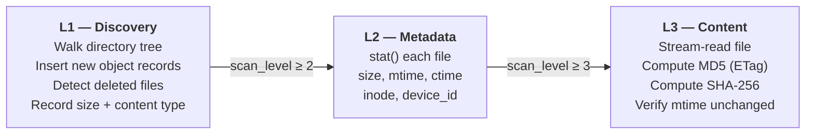
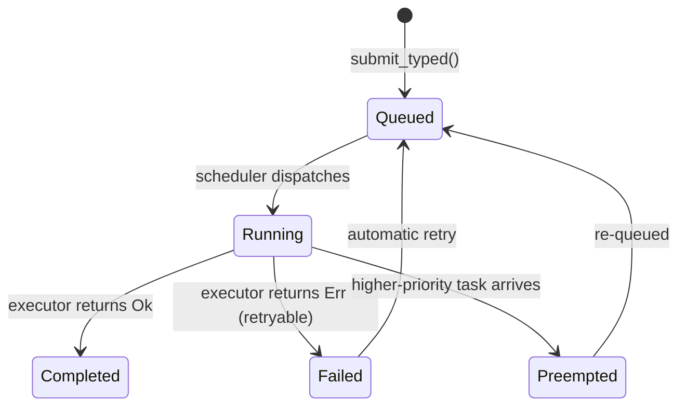
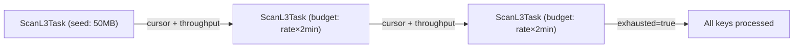
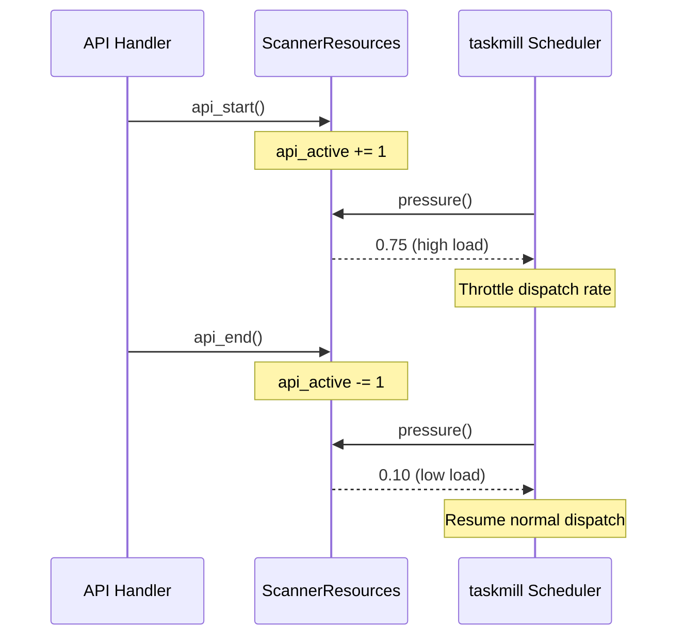
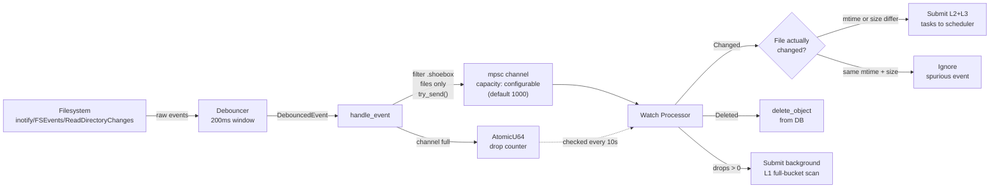
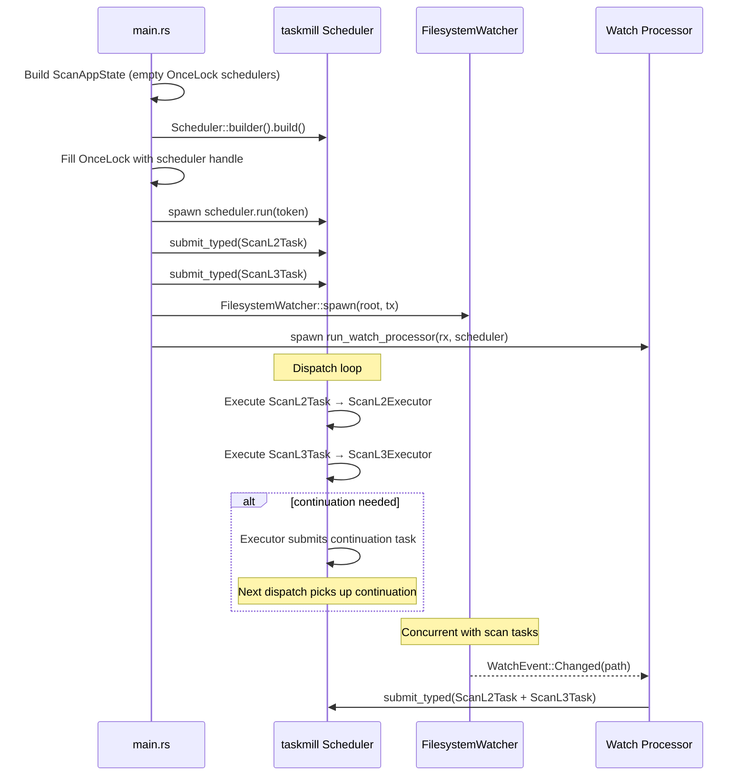

# Scanner Architecture

The scanner is a background subsystem that discovers files on disk and progressively enriches their metadata in the SQLite catalog. It runs alongside the S3-compatible API server, yielding resources to API traffic via backpressure controls.

Task scheduling and execution are handled by [taskmill](../../crates/taskmill), a generic SQLite-backed async task scheduler. Each scan level (L1, L2, L3) is a typed task with its own executor — taskmill handles persistence, deduplication, priority ordering, retries, and preemption.

## High-level overview

```mermaid
graph TB
    subgraph "Server Startup (per bucket)"
        MAIN[main.rs] -->|builds| SCHED[taskmill Scheduler<br>SQLite-backed]
        MAIN -->|submits initial<br>L2 + L3 tasks| SCHED
        MAIN -->|spawns| WATCHPROC[Watch Processor]
        MAIN -->|starts| FSWATCHER[Filesystem Watcher<br>notify + debouncer]
    end

    FSWATCHER -->|WatchEvent<br>channel| WATCHPROC
    WATCHPROC -->|submits<br>L2/L3 tasks| SCHED

    SCHED -->|dispatches| L1[ScanL1Executor]
    SCHED -->|dispatches| L2[ScanL2Executor]
    SCHED -->|dispatches| L3[ScanL3Executor]

    L1 -->|insert_objects_batch| DB[(SQLite<br>MetadataStore)]
    L2 -->|update_objects_metadata_batch| DB
    L3 -->|update_objects_hashes_batch| DB

    L1 -->|submits L2+L3| SCHED
    L2 -->|submits continuation| SCHED
    L3 -->|submits continuation| SCHED

    BP[ScannerResources<br>PressureSource] -.->|pressure()| SCHED
    API[API requests] -.->|api_start/api_end| BP
```

## Scan levels

The scanner uses a three-level progressive scan model. Each level builds on the previous one, and every object's `scan_level` column in the database records how far it has been scanned.



### L1 — Discovery (`scan_l1`)

- Acquires a dedicated SQLite connection and creates a temp table (`l1_disk`) to collect discovered files.
- Walks the bucket root using `async_walkdir`, skipping the `.shoebox` metadata directory.
- For each file on disk within the `ScanScope`:
  - Creates an `ObjectRecord` with UUID, key, parent directory, size, content type.
  - Batch-inserts into the temp table (1000 rows or 500ms flush timeout).
- After the walk completes, merges the temp table into `objects` with two SQL statements:
  - **INSERT** new objects that exist on disk but not in the catalog (`scan_level = 1`).
  - **DELETE** stale objects that are in the catalog but no longer on disk (bucket-wide scans only).
- Memory usage is O(1) regardless of file count — all working-set pressure is handled by SQLite's page cache rather than an in-memory `HashSet`.
- Idempotent: running L1 twice with no filesystem changes produces zero new discoveries.
- On completion, the `ScanL1Executor` submits downstream `ScanL2Task` and `ScanL3Task` if `target_level` warrants it.

### L2 — Metadata (`scan_l2`)

- The `ScanL2Executor` fetches up to 10,000 keys via keyset pagination (see [Batch limits](#batch-limits-and-continuation)).
- Calls `stat()` / `symlink_metadata()` on each file.
- Collects: `size`, `file_mtime`, `file_ctime`, `inode`, `device_id`.
- Platform-specific identity extraction via `platform::file_identity()` (Unix inode/dev, Windows file_index/volume_serial).
- Batched updates, same size/timeout thresholds as L1.
- Sets `scan_level = 2`.
- Submits a continuation `ScanL2Task` if more keys remain.

### L3 — Content hash (`scan_l3`)

- The `ScanL3Executor` fetches keys within an adaptive byte budget (see [Batch limits](#batch-limits-and-continuation)).
- **Symlinks are skipped**: `hash_one_file()` checks `symlink_metadata()` first — symlinks don't have independently hashable content in the S3 model. Skipped symlinks are promoted to `scan_level = 3` so they aren't re-queued.
- Hashes files **concurrently** using `futures::stream::buffer_unordered(concurrency)`. Each file is processed by `hash_one_file()`, which:
  - Streams file contents through dual hashers in a single pass:
    - **MD5** → stored as the S3 `ETag` (quoted hex).
    - **SHA-256** → stored as `content_hash` (`sha256:<hex>`).
  - Uses 64 KB read buffer for streaming I/O.
  - **Integrity check**: records `mtime` before and after reading. If the file was modified during the scan, the result is discarded and the file is skipped.
- After all files in the batch are hashed, results are written to the database in chunks of `BATCH_SIZE`.
- Sets `scan_level = 3`.
- Submits a continuation `ScanL3Task` with updated throughput estimate if more keys remain.

## Task scheduling (taskmill)

Scan work is scheduled through [taskmill](../../crates/taskmill), a SQLite-backed task scheduler. Each bucket gets its own `taskmill::Scheduler` instance backed by a `taskmill.db` file in the bucket's `.shoebox` directory. Taskmill provides:

- **Persistence** — tasks survive process restarts.
- **Deduplication** — submitting an already-queued task (by type + payload) is a no-op.
- **Priority ordering** — tasks are dispatched highest-priority first.
- **Preemption** — high-priority tasks pause running lower-priority tasks.
- **Automatic retries** — configurable retry count before permanent failure.
- **Throttle policy** — external `PressureSource` (API load) modulates dispatch rate.

### Task types

| Task | Type key | Priority | Payload |
|------|----------|----------|---------|
| `ScanL1Task` | `scan-l1` | NORMAL or BACKGROUND | bucket, scope, target_level |
| `ScanL2Task` | `scan-l2` | NORMAL or BACKGROUND | bucket, cursor |
| `ScanL3Task` | `scan-l3` | NORMAL or BACKGROUND | bucket, cursor, bytes_per_sec |

Each task type implements `TypedTask` for automatic JSON serialization and has a corresponding executor implementing `TaskExecutor`. The `background` flag on each task lowers its priority to `BACKGROUND`, allowing it to yield to normal-priority work.

### Task lifecycle



### Shared state

Executors access per-bucket state via `TaskContext::state::<ScanAppState>()`. The `ScanAppState` holds a `HashMap<String, BucketScanState>` where each entry contains:

- `metadata` — the bucket's `MetadataStore` (SQLite connection).
- `root` — the bucket's filesystem root path.
- `scheduler` — an `OnceLock<taskmill::Scheduler>` filled after the scheduler is built, breaking the circular dependency between app state and scheduler construction.

## Batch limits and continuation

To prevent memory pressure and allow interleaving with higher-priority work, each executor caps work per task:

| Level | Batching strategy |
|-------|-------------------|
| L2 — Metadata | Fixed count: 10,000 keys (`L2_BATCH_LIMIT`) |
| L3 — Content | **Adaptive byte budget** targeting ~2 minutes per batch |

### L2 batching

L2 uses `list_keys_below_scan_level(level, limit, after_key)` to fetch the next batch by key count.

### L3 adaptive byte budget

L3 batches are sized by **total bytes** rather than file count, so each batch takes roughly the same wall-clock time regardless of whether it contains many small files or a few large ones.

1. **Seed batch**: The first L3 batch uses a 50 MB byte budget (`L3_SEED_BYTES`) to calibrate throughput.
2. **Measure**: After each batch, the executor computes `bytes_per_sec` from elapsed time and total bytes attempted (including skipped files).
3. **Smooth**: The throughput estimate is updated using an exponential weighted moving average (EWMA, α=0.3). The first batch sets the baseline directly; subsequent batches blend 30% new measurement with 70% previous estimate to dampen oscillations from cache effects, file size skew, and other I/O variability.
4. **Adapt**: The next batch's byte budget is set to `smoothed_bytes_per_sec × 120s` (2-minute target), capped at 50 GB (`L3_MAX_BUDGET`).
5. **Carry forward**: The smoothed throughput estimate (`bytes_per_sec`) is passed to continuation tasks so it persists across batches.

The executor queries `list_keys_by_byte_budget(level, byte_budget, after_key)` which fetches keys with their sizes and accumulates until the budget is exceeded (with a 10,000-row safety cap).

### L3 concurrency

L3 hashing concurrency is determined by average file size in the batch. Smaller files are syscall-bound and benefit from parallelism; larger files are I/O-bound and run sequentially.

| Avg file size | Concurrency |
|---------------|-------------|
| ≤ 500 KB | 32 |
| 500 KB – 1 MB | 16 |
| 1 – 8 MB | 8 |
| > 8 MB | 1 |

### Continuation tasks

L2 and L3 use keyset pagination cursors so each level advances through the keyspace independently. When a batch completes with remaining work, the executor submits a **continuation task** carrying the cursor (and for L3, the throughput estimate).



Between continuation tasks, the scheduler can interleave higher-priority work (e.g. watch-triggered rescans), and backpressure throttling runs normally.

## Scan scope

Each L1 task has a `ScanScope` that constrains which files it operates on:

| Scope | Description | L1 behavior |
|-------|-------------|-------------|
| `Bucket` | Entire bucket | Full directory walk + deletion detection |
| `Subtree { prefix }` | Files under a prefix | Walk filtered by prefix |
| `Files(Vec<String>)` | Specific keys | Skips L1 walk entirely |

For `Files` scope, the worker skips L1 discovery and jumps straight to L2/L3 on the named keys. This is used by the watch processor for targeted rescans of individual changed files.

## Backpressure

The `ScannerResources` module prevents the scanner from starving the API server of I/O capacity. It implements `taskmill::PressureSource` so the scheduler can throttle task dispatch based on API load.



API load is calculated as `active_api_requests / total_permits` (default: 100 permits). The scheduler applies a three-tier throttle policy (`ThrottlePolicy::default_three_tier()`) that progressively slows task dispatch as pressure increases.

## Filesystem watcher

The watcher uses `notify` with `notify-debouncer-mini` (200ms debounce window) to detect real-time filesystem changes.



### Channel overflow recovery

The watcher callback uses `try_send()` (non-blocking) instead of `blocking_send()` to avoid stalling the OS notification thread, which could cause inotify/FSEvents queue overflow at the kernel level. When the channel is full, the event is dropped and a shared `AtomicU64` counter is incremented.

The watch processor checks this counter every 10 seconds. When drops are detected, it logs a warning with the count and submits a background `ScanL1Task` for a full-bucket scan to L3 to catch any files that were missed.

The channel capacity defaults to 1000 events but can be increased for high-churn environments via `watch_channel_capacity` in the global config file.

### Spurious event filtering

The watch processor compares the current `mtime` and `size` against stored values before submitting scan tasks. This avoids unnecessary work when the watcher fires due to access-time updates caused by the scanner's own reads.

For changed files, the processor calls `reset_scan_level(key, 1)` to mark the object for a full L2+L3 rescan. For new files (not yet in the DB), it inserts a fresh `ObjectRecord` at `scan_level = 1`.

## Startup sequence



On server startup, each bucket gets:
1. A `ScanAppState` entry with its `MetadataStore` and filesystem root.
2. A `taskmill::Scheduler` built with L1/L2/L3 executors, max concurrency of 1, and `ScannerResources` as a pressure source.
3. The scheduler handle stored in the `OnceLock` so executors can submit continuations.
4. Initial `ScanL2Task` and `ScanL3Task` submitted to process any objects at incomplete scan levels.
5. A `FilesystemWatcher` watching the bucket root recursively.
6. A `Watch Processor` task converting filesystem events into scan tasks.

All tasks respect the shared `CancellationToken` for graceful shutdown.

## Database schema

The scanner uses columns on the existing `objects` table (from `migrations/001_objects.sql`):

### Objects table columns

| Column | Type | Set by |
|--------|------|--------|
| `scan_level` | INTEGER | L1 (set to 1), L2 (2), L3 (3) |
| `file_mtime` | TEXT | L2 |
| `file_ctime` | TEXT | L2 |
| `inode` | INTEGER | L2 |
| `device_id` | INTEGER | L2 |
| `etag` | TEXT | L3 (MD5 hash) |
| `content_hash` | TEXT | L3 (SHA-256 hash) |

### Taskmill tables

Task scheduling state is stored in `taskmill.db` (per bucket, in the `.shoebox` directory). Taskmill manages its own schema for queued tasks, running tasks, and task history. The old `scan_jobs` and `bucket_scan_state` tables have been removed.

## Source files

| File | Purpose |
|------|---------|
| [mod.rs](../../src/scanner/mod.rs) | Module exports |
| [levels.rs](../../src/scanner/levels.rs) | L1/L2/L3 scan implementations |
| [tasks.rs](../../src/scanner/tasks.rs) | Typed task definitions and executors |
| [app_state.rs](../../src/scanner/app_state.rs) | Shared state for task executors |
| [worker.rs](../../src/scanner/worker.rs) | Watch processor |
| [backpressure.rs](../../src/scanner/backpressure.rs) | API-vs-scanner resource control (PressureSource) |
| [watcher.rs](../../src/scanner/watcher.rs) | notify-based filesystem watcher |
| [scope.rs](../../src/scanner/scope.rs) | Scan scope types (Bucket, Subtree, Files) |
| [platform.rs](../../src/scanner/platform.rs) | Cross-platform inode/device extraction |
