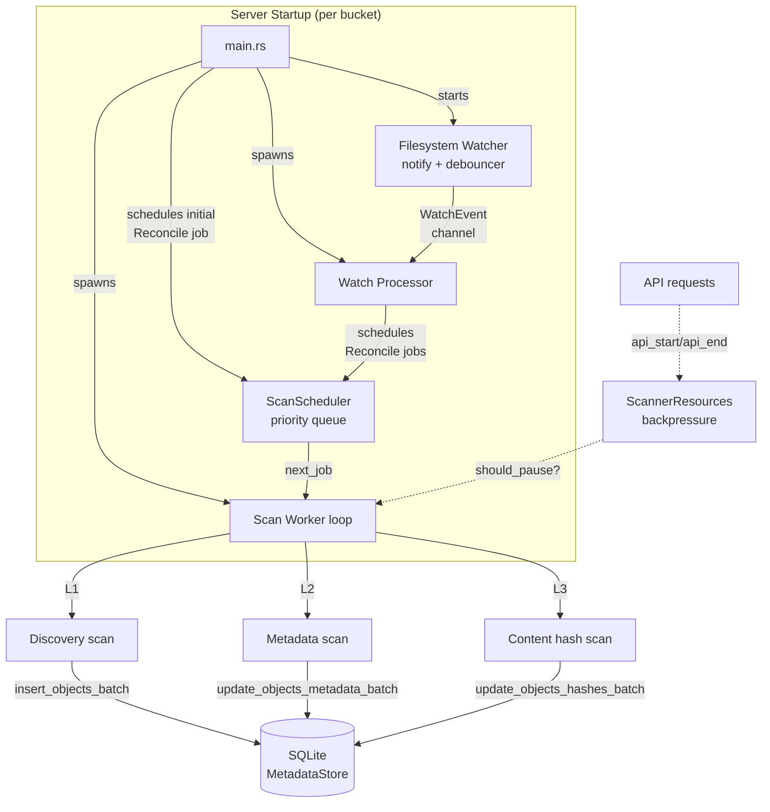
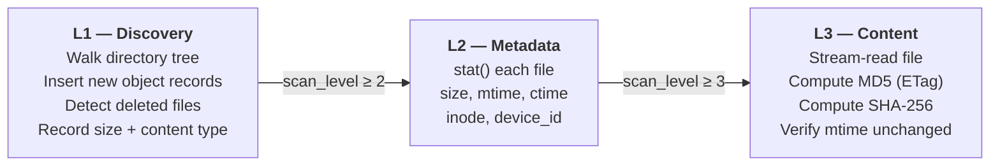
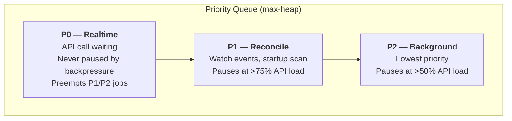
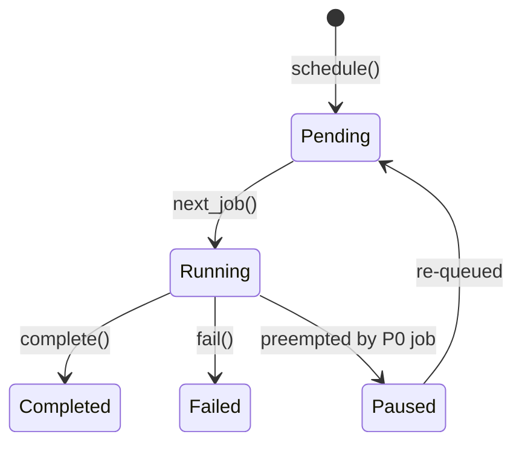
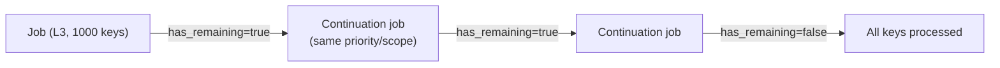
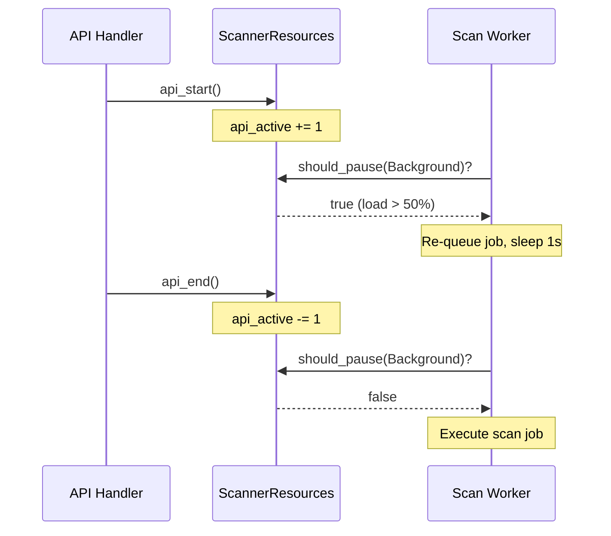
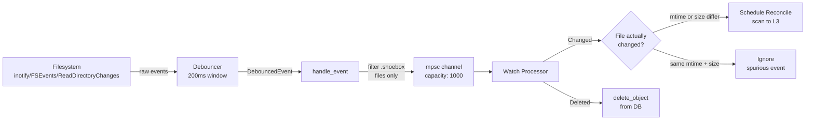
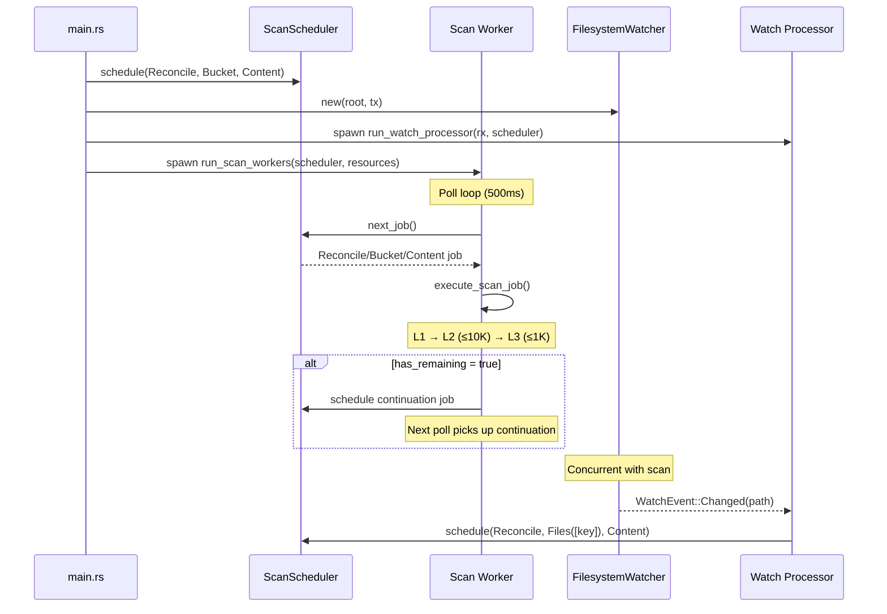

# Scanner Architecture

The scanner is a background subsystem that discovers files on disk and progressively enriches their metadata in the SQLite catalog. It runs alongside the S3-compatible API server, yielding resources to API traffic via backpressure controls.

## High-level overview

## Scan levels

The scanner uses a three-level progressive scan model. Each level builds on the previous one, and every object's `scan_level` column in the database records how far it has been scanned.

### L1 — Discovery (`scan_l1`)

- Acquires a dedicated SQLite connection and creates a temp table (`l1_disk`) to collect discovered files.
- Walks the bucket root using `async_walkdir`, skipping the `.shoebox` metadata directory.
- For each file on disk within the `ScanScope`:
  - Creates an `ObjectRecord` with UUID, key, parent directory, size, content type.
  - Batch-inserts into the temp table (1000 rows or 500ms flush timeout).
- After the walk completes, merges the temp table into `objects` with two SQL statements:
  - **INSERT** new objects that exist on disk but not in the catalog (`scan_level = 1`).
  - **DELETE** stale objects that are in the catalog but no longer on disk (bucket-wide scans only).
- Memory usage is O(1) regardless of file count — all working-set pressure is handled by SQLite's page cache rather than an in-memory `HashSet`.
- Idempotent: running L1 twice with no filesystem changes produces zero new discoveries.

### L2 — Metadata (`scan_l2`)

- Receives a pre-fetched list of keys from the worker (see [Batch limits](#batch-limits-and-continuation)).
- Calls `stat()` / `symlink_metadata()` on each file.
- Collects: `size`, `file_mtime`, `file_ctime`, `inode`, `device_id`.
- Platform-specific identity extraction via `platform::file_identity()` (Unix inode/dev, Windows file_index/volume_serial).
- Batched updates, same size/timeout thresholds as L1.
- Logs per-file progress with `[i/total]` format.
- Sets `scan_level = 2`.

### L3 — Content hash (`scan_l3`)

- Receives a pre-fetched list of keys from the worker (see [Batch limits](#batch-limits-and-continuation)).
- Streams file contents through dual hashers in a single pass:
  - **MD5** → stored as the S3 `ETag` (quoted hex).
  - **SHA-256** → stored as `content_hash` (`sha256:<hex>`).
- Uses 64 KB read buffer for streaming I/O.
- **Integrity check**: records `mtime` before and after reading. If the file was modified during the scan, the result is discarded and the file is skipped.
- Sets `scan_level = 3`.

## Scheduler

The `ScanScheduler` is a priority queue (`BinaryHeap`) that orders jobs by priority, then by creation time (oldest first).

### Job lifecycle

### Preemption

When a `Realtime` (P0) job is scheduled, all currently active non-Realtime jobs are moved back to `Paused` status and re-queued. This ensures API-triggered scans get immediate attention.

## Batch limits and continuation

To prevent memory pressure and allow interleaving with higher-priority work, the worker caps the number of keys processed per job:

| Level | Batch limit | Constant |
|-------|-------------|----------|
| L2 — Metadata | 10,000 keys | `L2_BATCH_LIMIT` |
| L3 — Content | 1,000 keys | `L3_BATCH_LIMIT` |

The worker queries `list_keys_below_scan_level(level, limit)` to fetch the next batch. When the returned key count reaches the limit, `execute_scan_job` returns `has_remaining = true` and the worker schedules a **continuation job** with the same priority, scope, and target level. This repeats until all keys are processed.

Between continuation jobs the scheduler can interleave higher-priority work (e.g. a `Realtime` API-triggered scan), and backpressure checks run normally. `Files` scopes bypass batch limits since the caller already provides a bounded key list.

## Scan scope

Each job has a `ScanScope` that constrains which files it operates on:

| Scope | Description | L1 behavior |
|-------|-------------|-------------|
| `Bucket` | Entire bucket | Full directory walk + deletion detection |
| `Subtree { prefix }` | Files under a prefix | Walk filtered by prefix |
| `Files(Vec<String>)` | Specific keys | Skips L1 walk entirely |

For `Files` scope, the worker skips L1 discovery and jumps straight to L2/L3 on the named keys. This is used by the watch processor for targeted rescans of individual changed files.

## Backpressure

The `ScannerResources` module prevents the scanner from starving the API server of I/O capacity.

| Priority | Pause threshold |
|----------|----------------|
| Background (P2) | API load > 50% |
| Reconcile (P1) | API load > 75% |
| Realtime (P0) | Never pauses |

API load is calculated as `active_api_requests / total_permits` (default: 100 permits).

## Filesystem watcher

The watcher uses `notify` with `notify-debouncer-mini` (200ms debounce window) to detect real-time filesystem changes.

### Spurious event filtering

The watch processor compares the current `mtime` and `size` against stored values before scheduling a rescan. This avoids unnecessary work when the watcher fires due to access-time updates caused by the scanner's own reads.

For changed files, the processor calls `reset_scan_level(key, 1)` to mark the object for a full L2+L3 rescan. For new files (not yet in the DB), it inserts a fresh `ObjectRecord` at `scan_level = 1`.

## Checkpointing

`ScanCheckpoint` tracks progress within a scan job for pause/resume support. It records:

- `last_processed_key` — the key of the last successfully processed file.
- `files_completed` / `files_total` — for progress reporting.

When a job is preempted or the server shuts down, the checkpoint allows resumption from the last processed key rather than restarting from scratch.

## Database schema

The scanner uses two dedicated tables (from `migrations/004_scanner.sql`) plus columns on the existing `objects` table:

### Objects table additions

| Column | Type | Added by |
|--------|------|----------|
| `scan_level` | INTEGER | L1 (set to 1), L2 (2), L3 (3) |
| `file_mtime` | TEXT | L2 |
| `file_ctime` | TEXT | L2 (migration 004) |
| `inode` | INTEGER | L2 (migration 004) |
| `device_id` | INTEGER | L2 (migration 004) |
| `etag` | TEXT | L3 (MD5 hash) |
| `content_hash` | TEXT | L3 (SHA-256 hash) |

### scan_jobs table

Tracks scheduled and completed scan jobs with priority, scope, target level, and progress.

### bucket_scan_state table

Singleton row tracking aggregate scan progress per bucket: total files, files at each scan level, and timestamps of the last L1 and L3 scans.

## Startup sequence

On server startup, each bucket gets:
1. A `Reconcile` priority job scheduled for a full bucket scan to `Content` level (L1→L2→L3).
2. A `FilesystemWatcher` watching the bucket root recursively.
3. A `Watch Processor` task converting filesystem events into targeted scan jobs.
4. A `Scan Worker` task polling the scheduler and executing jobs.

All tasks respect the shared `CancellationToken` for graceful shutdown.

## Source files

| File | Purpose |
|------|---------|
| [mod.rs](../../src/scanner/mod.rs) | Module exports |
| [levels.rs](../../src/scanner/levels.rs) | L1/L2/L3 scan implementations |
| [scheduler.rs](../../src/scanner/scheduler.rs) | Priority queue, job types, preemption |
| [worker.rs](../../src/scanner/worker.rs) | Worker loop, job execution, watch processor |
| [backpressure.rs](../../src/scanner/backpressure.rs) | API-vs-scanner resource control |
| [watcher.rs](../../src/scanner/watcher.rs) | notify-based filesystem watcher |
| [scope.rs](../../src/scanner/scope.rs) | Scan scope types (Bucket, Subtree, Files) |
| [checkpoint.rs](../../src/scanner/checkpoint.rs) | Pause/resume progress tracking |
| [platform.rs](../../src/scanner/platform.rs) | Cross-platform inode/device extraction |
