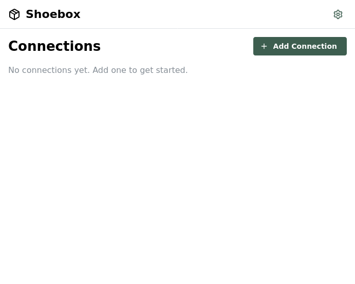
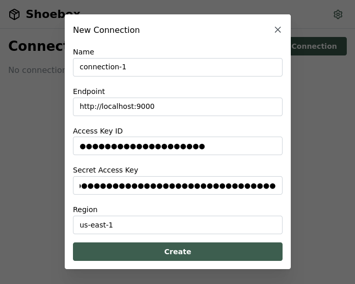
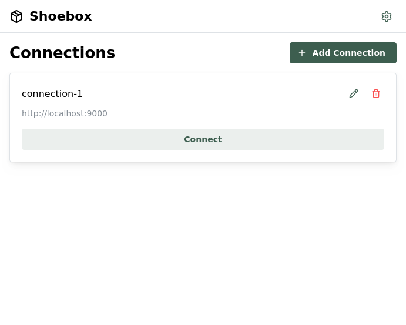
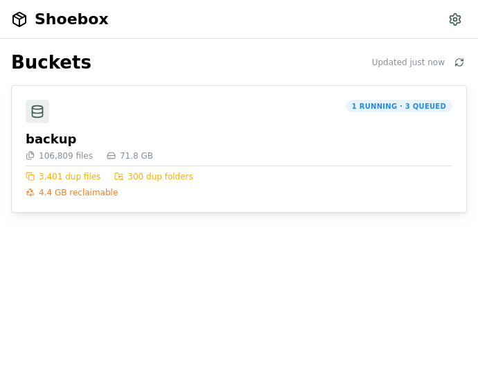
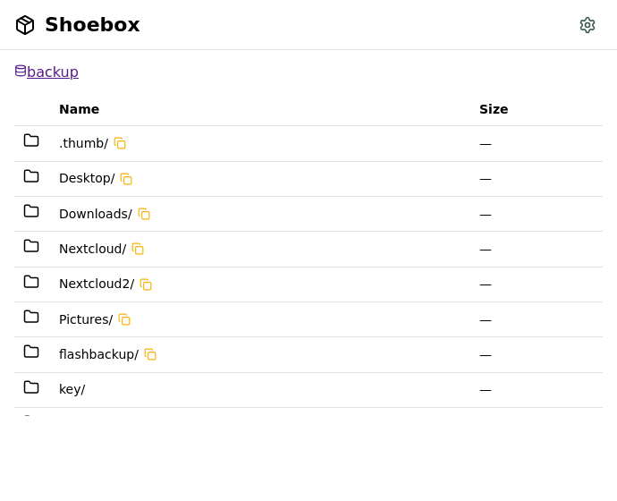

# Quickstart

## 1. Start the server

```bash
# Serve your Documents folder
shoebox ~/Documents

# Output:
# Serving 1 bucket on http://localhost:9000
#   documents → /home/user/Documents
#     Access Key: AKIA...
#     Secret Key: ...
```

Or with Docker:

```bash
docker run -v ~/Documents:/data -p 9000:9000 ghcr.io/deepjoy/shoebox /data
```

## 2. Enable browser access (CORS)

Shoebox prints a ready-to-run `curl` command on startup — just copy and run it:

```bash
export AWS_ACCESS_KEY_ID='<from startup output>'
export AWS_SECRET_ACCESS_KEY='<from startup output>'
export BUCKET='documents'

curl -X PUT "http://localhost:9000/${BUCKET}?cors" \
  --aws-sigv4 "aws:amz:us-east-1:s3" \
  --user "$AWS_ACCESS_KEY_ID:$AWS_SECRET_ACCESS_KEY" \
  -H "Content-Type: application/json" \
  -d '[{"allowed_origins":["*"],"allowed_methods":["GET","PUT","POST","DELETE","HEAD"],"allowed_headers":["*"],"expose_headers":["ETag","x-amz-request-id"],"max_age_seconds":3600}]'
```

## 3. Browse with the webapp

Open **https://deepjoy.github.io/shoebox-webapp/** in your browser. Click **Add Connection** to get started:



Enter your server URL (`http://localhost:9000`) and the credentials from the startup output, then click **Create**:



Your connection is saved. Click **Connect** to open it:



Shoebox scans your files in the background — duplicates and stats appear as processing completes:



Click a bucket to browse its contents:



## Multiple Buckets

```bash
# Serve multiple directories as separate buckets
shoebox ~/Photos ~/Documents ~/Backups
```

## Custom Host/Port

```bash
shoebox --host 127.0.0.1 --port 8080 ~/Documents
```

## Validate Configuration

```bash
shoebox validate ~/Documents
```

## Next Steps

- [CLI Reference](guides/cli-reference.md) — All commands, flags, and options
- [Configuration](guides/configuration.md) — Global config, data directory, environment variables
- [S3 Compatibility](guides/s3-compatibility.md) — AWS CLI, rclone, SDK setup
- [Installation](installation.md) — Docker Compose examples and deployment options
- [All Guides](README.md) — Full documentation index
